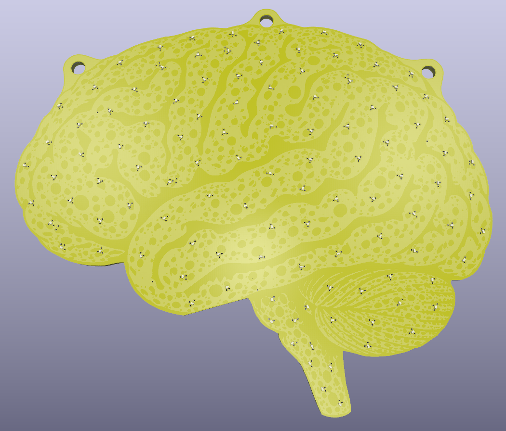
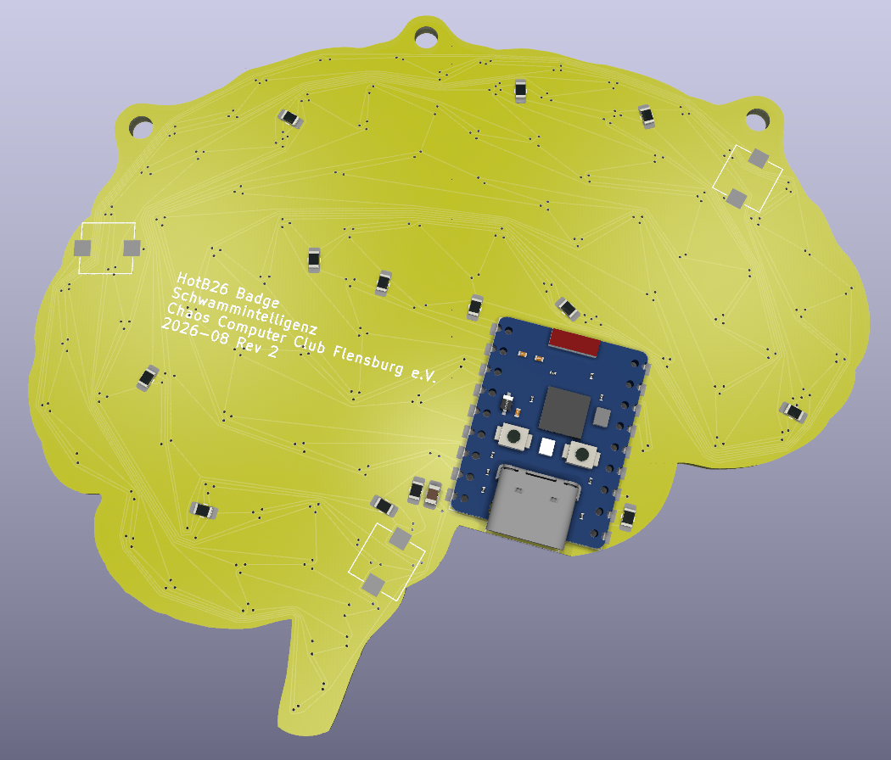

# badge-schwammintelligenz

## Ideensammlung
- PCB mit Gehirn-Form und Schwamm-Farbe
  - gelber Lötstopplack
  - nacktes FR4 als Kontrastfarbe für Porösität des Schwammes
  - Konturlinien in schwarzem oder weißem Bestückungsdruck
- viele sehr kleine LEDs auf der Vorderseite
  - blitzen auf, um Neuronen zu mimen
  - mit [Charlieplexing](https://en.wikipedia.org/wiki/Charlieplexing#Origin) kann man 110 LEDs mit nur 11 Pins einzeln ansteuern
    - (`nLedsMax = nGpio * (nGpio - 1)`)
    - [Beispielcode für Charlieplexing](https://goodarduinocode.com/guides/charlieplexing) -> Zeilenweise ansteuern
  - [XINGLIGHT XL0201UWC](https://jlcpcb.com/partdetail/XINGLIGHT-XL0201UWC/C965789) wäre z.B. nur 0,7 mm * 0,4 mm groß (Pads komplett unter dem Package) und kostet nur 0,0326 USD / St. bei 5000 St. Abnahme
- Kompatibilität zu Mesh-Cat-Ears?
  - [Rudelblinken](https://github.com/zebreus/rudelblinken)
  - Die laufen mit BLE auf einem ESP32-C3
  - Wir könnten denselben Controller nutzen, um mit den Katzenohren meshen zu können
- ein Taster auf der Rückseite, um einen Puls auszulösen
  - erstmal an den eigenen LEDs
  - langfristig sonst auch auf Gehirnen in der Nähe
  - evtl. jeder Mesh-Teilnehmer eine eigene LED?
  - 3-4 Taster (Soft touch) (Typ [Alps SKPM](https://tech.alpsalpine.com/e/products/detail/SKPMANE010/)?)

## Implementierung der Farben

Die Platine wird mit **gelbem Lötstopplack** und **weißem Bestückungsdruck** gefertigt.

Kupfer auf der Rückseite minimal halten und wo möglich unter dem Kupfer der Oberseite verlegen.

Der Entwurf sieht folgendermaßen aus:

### Farbaufbau

| Farbe | Objekte | Beteiligte Lagen | Notizen |
| --- | --- | --- | --- |
| weiß | ??? | F.Silkscreen | Bestückungsdruck (muss auf Lötstopplack liegen) |
| silber | ??? | F.Cu, F.Mask | freies Kupfer mit HASL Finish |
| hellergelb | Schwammoberfläche | F.Mask | blankes FR4 (kein Kupfer auf der Rückseite) - ca. `e9d645ff` |
| hellgelb | Vertiefung flach | none | Lötstopplack auf FR4 (kein Kupfer auf der Rückseite) - ca. `f6c50eff` |
| dunkelgelb | Vertiefung tief | F.Cu | Lötstopplack auf Kupfer - ca. `e8b203ff` |
| grüngelb | --- | F.Cu, F.Mask | blankes FR4 mit Kupfer auf der Rückseite |

### Lagenaufbau

| Lage | Objekte |
| --- | --- |
| F.Cu | union( silber, dunkelgelb ) |
| F.Mask | invert( union( weiß, hellgelb, dunkelgelb ) ) |
| F.Silkscreen | weiß |

## BOM

Die folgenden Preise beziehen sich auf ein einzelnes Badge wenn wir Material für 50 Stück kaufen.

- JLCPCB Preis vom 2026-06-15
  - PCB ca. 100 mm x 100 mm
  - Silkscreen gleb
  - 1,6 mm dick
  - LeadFree HASL
  - je 110 St. XINGLIGHT XL-0201UWC (LCSC C965789) von JLCPCB auf der Vorderseite bestückt
  - 258,80 € (Material und Produktion) + 48,03 € (Versand EuroPacket) = 306,83 €
  - Es ist mit 2 Wochen Lieferzeit zu rechnen, wenn es keine Rücksprachen braucht

| Anzahl | Preis | Bezeichnung |
| --- | --- | --- |
| 1 | 6,14 € | PCB mit LEDs (Stand 2026-06-15 von JLCPCB teilbestückt) |
| 1 | ca. 4 € | ESP32-C3 |
| ? | ??? | ??? |

## Firmware

Liegt in `firmware/` und läuft auf dem Waveshare ESP32-C3-Zero. Bauen wahlweise mit der
Arduino IDE (Board „Waveshare ESP32-C3-Zero“, Bibliothek NimBLE-Arduino 2.x) oder mit
PlatformIO im Repo-Root: `pio run -t upload`.

- `firmware/led_map.h` wird von `tools/gen_led_map.py` aus `pcb/pcb.kicad_pcb` erzeugt
  (Pin-Paar und Position jeder LED). Nach Layoutänderungen neu ausführen, das Skript
  schreibt auch `web/led_map.js`.
- Ein Timer-Interrupt scannt die Charlieplex-Matrix mit 4 Bit Helligkeit, `loop()`
  rendert Animationen in einen Framebuffer. Modi: Neuronen, Wellen, Laufschrift, Rohbild vom Handy,
  Löt-Test (`mode test`: eine LED nach der anderen in Zeilen/Spalten-Reihenfolge, jede wird per
  Serial und BLE mit Zeile, Spalte und GPIO-Paar gemeldet; eine fehlende LED zeigt die Lötstelle).
- Taster: kurz drücken löst eine Welle aus (auch auf Badges in Reichweite), lang drücken
  wechselt den Modus. Alle drei Taster liegen auf demselben Eingang.
- Sync: Badges senden Modus, Tempo, Helligkeit und Phase per BLE-Advertising. Die höchste
  Änderungsgeneration gewinnt, bei Gleichstand die kleinere ID. Kein Verbindungsaufbau nötig.
- BLE-Anzeigename ist standardmäßig `Schwammhirn-<ID>` aus der Bluetooth-MAC, per Kommando
  `name …` oder auf der Web-Seite änderbar. Die Web-Seite findet Badges über die
  Herstellerkennung im Werbepaket, unabhängig vom Namen.
- Steuerung per Serial (115200) oder BLE mit denselben Textkommandos, Liste am Anfang
  von `firmware/firmware.ino`. BLE nutzt den Nordic-UART-Service, jede BLE-Terminal-App
  funktioniert also auch.

### Web-Steuerung

`web/index.html` im Browser öffnen (Chrome/Edge auf Android oder Desktop, auf dem iPhone
der Browser „Bluefy“), „Verbinden“ drücken. Zeigt live das Bild des Badges, im Modus
„Malen“ lassen sich LEDs antippen. Funktioniert direkt aus dem Dateisystem oder gehostet
unter https://schwammhirn.c3fl.de/ (Web Bluetooth braucht HTTPS oder localhost).

Firmware flashen ohne Toolchain: Auf der Seite gibt es einen Button „Firmware flashen“ (ESP
Web Tools, Chrome/Edge am Desktop). Die Binaries liegen in `web/flash/`. Nach einer Firmware-
Änderung: `pio run`, Code committen, dann `tools/export_firmware.sh` (schreibt den Commit-Hash als
Version ins Manifest) und die Binaries als eigenen Commit nachschieben.

Deployment: Das `Dockerfile` im Repo-Root liefert `web/` per nginx aus. In Coolify eine
neue Ressource vom Typ „Public Repository“ mit Build Pack „Dockerfile“ anlegen, Domain
eintragen, fertig. Port ist 80, HTTPS macht Coolify per Let's Encrypt.
